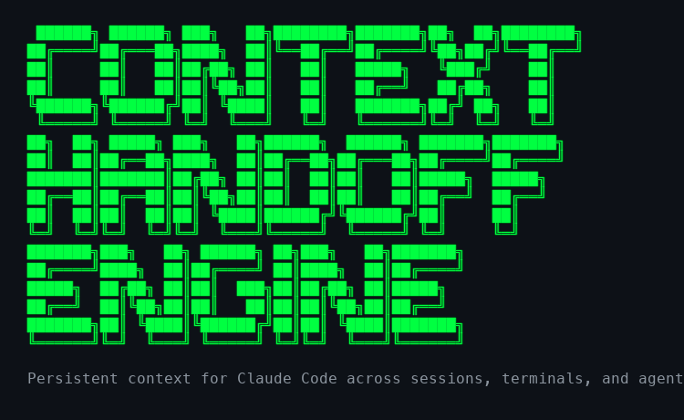

<p align="center">
  
</p>

[](LICENSE)
[](https://docs.anthropic.com/en/docs/claude-code)
[](https://github.com/shawnla90/recursive-drift)

**[English](README.md)** | [中文](README.zh.md)

---

## The Problem

Claude Code starts every session with zero memory. Five failure modes compound as you scale:

1. **Zero context on restart.** You open a terminal Monday morning and spend 10 minutes re-explaining what you built Friday. Multiply by every session.

2. **Race conditions across terminals.** You run 4 terminals. Two write handoff files. The last one wins. Three sessions of context vanish.

3. **Memory truncation.** Your MEMORY.md grows to 400 lines. Claude only loads the first 200. Half your project knowledge silently disappears.

4. **Lossy agent handoffs.** You spawn a subagent. It finishes. The parent gets a summary, not the decisions. The next agent re-litigates choices already made.

5. **Decision drift in teams.** Three agents work in parallel. Agent A picks snake_case. Agent B picks camelCase. Agent C picks whatever it feels like. Nobody logged the decision.

This repo is the infrastructure that fixes all five.

---

## Quick Start

### Tier 1: Just Handoffs (5 minutes)

Copy `templates/claude-md-minimal.md` into your project as `CLAUDE.md`. Done.

```bash
curl -o CLAUDE.md https://raw.githubusercontent.com/shawnla90/context-handoff-engine/main/templates/claude-md-minimal.md
mkdir -p ~/.claude/handoffs
```

You now have parallel-safe session handoffs. Every session writes its own file, reads all unconsumed ones on start, and marks them done.

### Tier 2: Handoffs + Memory + Self-Improvement (15 minutes)

```bash
curl -o CLAUDE.md https://raw.githubusercontent.com/shawnla90/context-handoff-engine/main/templates/claude-md-with-memory.md
mkdir -p ~/.claude/handoffs tasks
touch tasks/lessons.md tasks/todo.md
```

Copy the memory index template into your auto-memory directory:

```bash
mkdir -p ~/.claude/projects/$(pwd | tr '/' '-')/memory
curl -o ~/.claude/projects/$(pwd | tr '/' '-')/memory/MEMORY.md \
  https://raw.githubusercontent.com/shawnla90/context-handoff-engine/main/memory/memory-index-template.md
```

You now have handoffs + structured persistent memory + a self-improvement loop that accumulates lessons across sessions.

### Tier 3: Full Engine (30 minutes)

```bash
curl -o CLAUDE.md https://raw.githubusercontent.com/shawnla90/context-handoff-engine/main/templates/claude-md-full.md
mkdir -p ~/.claude/handoffs ~/.claude/teams tasks
touch tasks/lessons.md tasks/todo.md
```

Then customize the team constraints and routing files for your project. See `teams/` and `routing/` for templates.

---

## Architecture

The engine has 6 layers. Each layer solves a specific failure mode. Use as many as you need.

```
Layer 6: Routing ─────────── Which execution pattern fits this task?
Layer 5: Teams ───────────── How do parallel agents coordinate?
Layer 4: Agent Handoffs ──── How does context transfer between agents?
Layer 3: Self-Improvement ── How do mistakes become rules?
Layer 2: Memory ──────────── How does knowledge persist across sessions?
Layer 1: Handoffs ────────── How does session state transfer?
```

### Layer 1: Parallel-Safe Session Handoffs

**Problem solved:** Race conditions when multiple terminals write handoffs.

Each session writes to `~/.claude/handoffs/<timestamp>_<slug>.md`. No overwrites. On session start, the agent reads all unconsumed handoffs, prints a summary, then renames them with a `_done` suffix.

**The 4 operations:**
- **Write:** `~/.claude/handoffs/YYYY-MM-DD_HHMMSS_<slug>.md`
- **Read:** `ls ~/.claude/handoffs/*.md | grep -v '_done.md$'`
- **Consume:** Rename `file.md` to `file_done.md` after reading
- **Clean:** `find ~/.claude/handoffs -name '*_done.md' -mtime +7 -delete`

See [`handoffs/`](handoffs/) for the full template and migration guide.

### Layer 2: Structured Memory Persistence

**Problem solved:** Memory files grow unbounded and get truncated.

The memory index (`MEMORY.md`) stays under 200 lines. It contains quick-reference facts and links to topic files (`identity.md`, `infrastructure.md`, `completed-work.md`) that hold the details. Claude loads MEMORY.md automatically. Topic files are loaded on-demand when relevant.

**Architecture:**
```
~/.claude/projects/<project>/memory/
├── MEMORY.md              # Always loaded (keep under 200 lines)
├── identity.md            # Who, what, context
├── infrastructure.md      # Models, paths, services
├── completed-work.md      # Archive of done work
└── patterns.md            # Recurring solutions
```

See [`memory/`](memory/) for templates and examples.

### Layer 3: Self-Improvement Loop

**Problem solved:** Same mistakes repeat across sessions.

After every correction from the user, the agent writes a lesson to `tasks/lessons.md` with date, context, and a rule. On session start, the agent reads all lessons and follows them. Over time, mistake rate drops because the rules accumulate.

**The cycle:** Correction → Lesson → Rule → Prevention

See [`self-improvement/`](self-improvement/) for templates.

### Layer 4: Agent-to-Agent Context

**Problem solved:** Subagents lose decisions when context transfers back to parent.

When handing off between agents, produce a standalone context document with 6 sections: context, accomplishments, key files, open questions, next steps, workflow hooks. The receiving agent can operate without any prior conversation.

See [`agent-handoffs/`](agent-handoffs/) for the template and examples.

### Layer 5: Multi-Agent Team Coordination

**Problem solved:** Parallel agents make conflicting decisions.

9 rules that prevent chaos when multiple agents work simultaneously:
1. File ownership (one writer per file per wave)
2. Shared decisions log
3. Read before write
4. Wave discipline (dependency-based sequencing)
5. Build gate (no deploy until verified)
6. Context before action
7. Scope isolation
8. Fresh context per executor
9. Anti-patterns to avoid

See [`teams/`](teams/) for the genericized constraint system.

### Layer 6: Routing Decision Framework

**Problem solved:** Defaulting to teams when subagents would be faster, or doing everything solo when parallelism would help.

Score each task across 5 dimensions (file count, concern separation, handoff requirement, review requirement, quality gate) to route to the right execution pattern:
- **Pattern A:** Single focused session
- **Pattern B:** Parallel subagents
- **Pattern C:** Agent teams

See [`routing/`](routing/) for the scoring framework and quick reference.

---

## How It Differs

| Approach | Context Survives Restart? | Parallel Safe? | Learns From Mistakes? | Agent Coordination? |
|----------|--------------------------|----------------|----------------------|---------------------|
| No handoffs | No | N/A | No | No |
| Single handoff file | Yes | No (last write wins) | No | No |
| System prompts only | Partial | Yes | No | No |
| RAG / vector search | Yes | Yes | No | No |
| **Context Handoff Engine** | **Yes** | **Yes** | **Yes** | **Yes** |

---

## Directory Structure

```
context-handoff-engine/
├── README.md                        # You are here
├── handoffs/                        # Layer 1: Parallel-safe session handoffs
├── memory/                          # Layer 2: Structured memory persistence
├── self-improvement/                # Layer 3: Correction accumulator
├── agent-handoffs/                  # Layer 4: Agent-to-agent context
├── teams/                           # Layer 5: Multi-agent coordination
├── routing/                         # Layer 6: Decision framework
├── templates/                       # Copy-paste CLAUDE.md files (start here)
├── examples/                        # Working directory structures
└── guides/                          # Step-by-step setup guides
```

## Companion to Recursive Drift

This repo is the infrastructure layer of [recursive-drift](https://github.com/shawnla90/recursive-drift), a methodology for building with AI agents. Recursive drift defines the process. This engine handles the plumbing - making sure context persists, agents coordinate, and mistakes become rules.

You can use this engine without recursive-drift. You can use recursive-drift without this engine. They're better together.

---

## Contributing

See [CONTRIBUTING.md](CONTRIBUTING.md). Templates should be copy-paste ready and tested in actual Claude Code sessions.

## License

[MIT](LICENSE)
